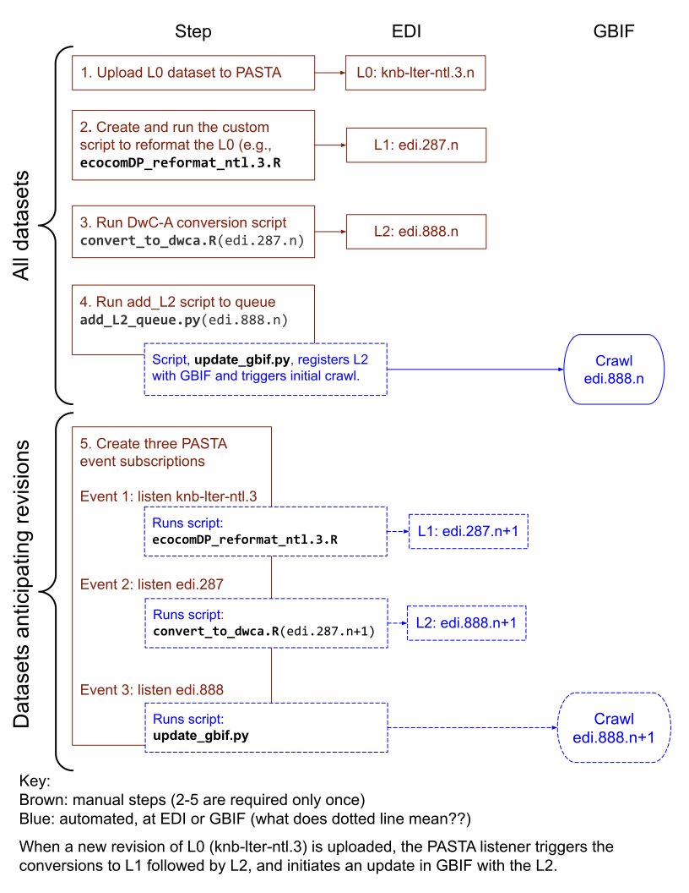
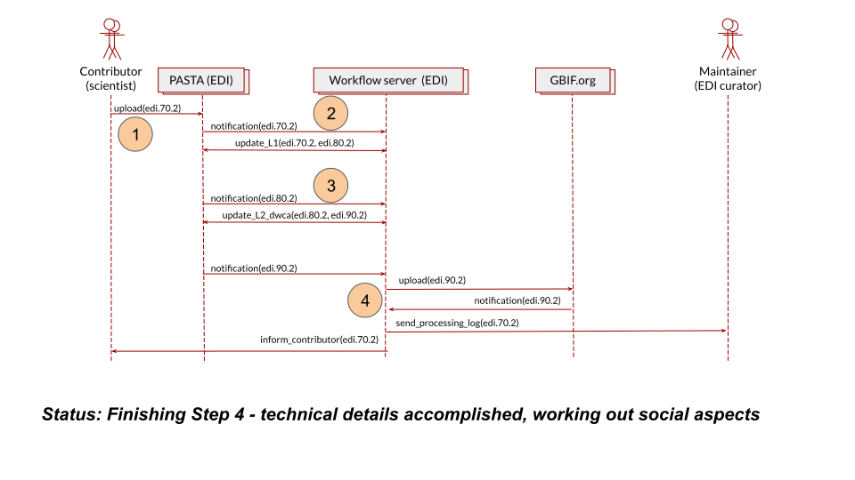

# implementation.md 

describes EDI's GBIF resistrar and how to work with it

initially, a diagram and table describing steps. 

| Step | Who | Discription | 
| ------ | ---------- | ------------------------------------------------- |
| 1 | data submitter | upload L0 package | 
| 2 | EDI (or data submitter) | create L0 ecocomDP conversion script; create L1 pkg (include script); upload L1 package| 
| 2.1 | EDI and data submitter | determine if L0 is a candidate for GBIF submission | 
| 3 | EDI | Run DwC-A conversion script (create a L2 from L1) | 
| 4 | EDI | add L2 identifier to GBIF queue | 
| 5 | EDI | Create 3 PASTA event subscriptions | 
| 5.1 | EDI | Listener for new revision of L0 | 
| 5.2 | EDI | Listener for new revision of L1| 
| 5.3 | EDI | Listener for new revision of L2 | 
| 0 | EDI | TBD | 

